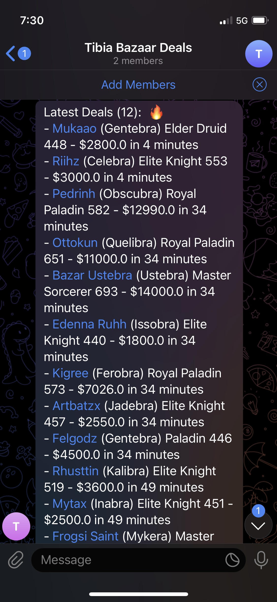

# Tibia Bazaar Scrapper

Simple toolset in order to scrap Bazaar data from [Tibia official website](https://www.tibia.com/charactertrade/?subtopic=currentcharactertrades).

Scrappers:
- Tibia Bazaar - Current Auctions
- Tibia Bazaar - Auction Details (from Current Auctions)

Join our [Telegram group](https://t.me/+h_j8ADjTToBkYjBh) and get the latest deals!

## Requirements

This project requires Python 3.9.

If you don't have Python installed, you can download it from the [official Python website](https://www.python.org/downloads/) and follow the installation instructions for your operating system.

## Installation

1. Clone the repository:

   ```sh
   git clone https://github.com/shakkurcwb/TibiaScrapper
   ```

2. Navigate to project repository:

    ```sh
    cd TibiaScrapper
    ```

3. Install Python dependencies using Pip:

    ```bash
    pip install -r requirements.txt
    ```

4. Create a copy of the `.env.example` file and rename it to `.env`.

## Telegram Notifications (Optional)

If you want to enable Telegram notifications for this project, you'll need to obtain a Telegram bot token.

#### Create a Telegram Bot:

- Open the Telegram app and search for the "BotFather" bot.
- Start a chat with BotFather and use the /newbot command to create a new bot.
- Follow the instructions to choose a name and username for your bot.
- Once your bot is created, BotFather will provide you with a token. Keep this token secure, as it will be used to authenticate your bot.

#### Configure the Telegram Token:

Update the .env and add the Telegram bot token.

```python
TELEGRAM_BOT_TOKEN = "your_bot_token_here"
TELEGRAM_CHAT_ID = "your_chat_id_here"
```

This will enable you to send notification containing the best deals available in the market!

FAQ: https://sean-bradley.medium.com/get-telegram-chat-id-80b575520659

## Output (Sample):

```sh
Scraping current auctions

Clearing current auctions pages
Cleared current auctions pages

Collecting current auctions pages
Collecting pages from 1 to 10
Collected pages from 1 to 10 in 0 minutes and 5 seconds

Extracting current auctions pages
Extracting pages from 1 to 10
Extracted pages from 1 to 10 in 0 minutes and 1 seconds

Processing current auctions pages
Processing pages from 1 to 10
Processed pages from 1 to 10 in 0 minutes and 0 seconds

Scrapping pages from 1 to 10 in 0 minutes and 6 seconds

Filtering auctions
Filtered 250 auctions to 12 auctions

Notifying auctions
Notification sent to subscribers

Next execution in 5 minutes...
```

## Picture


